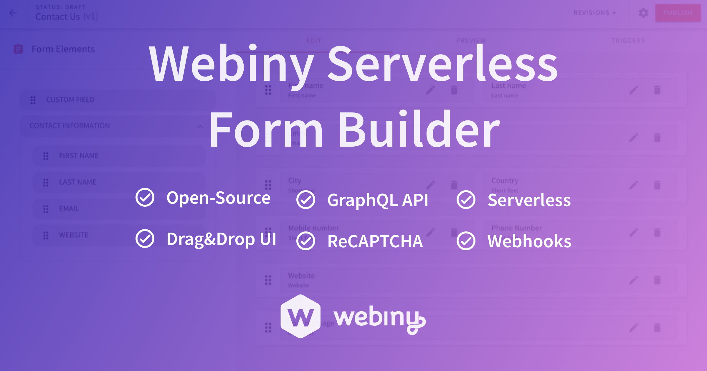
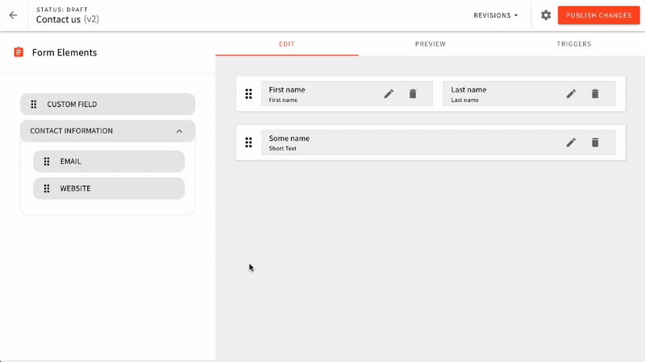
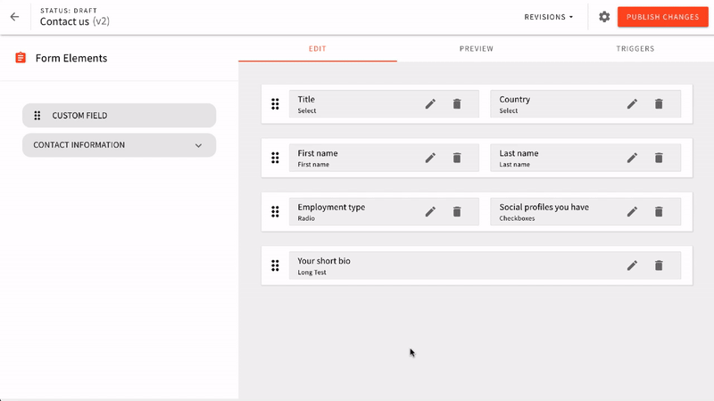
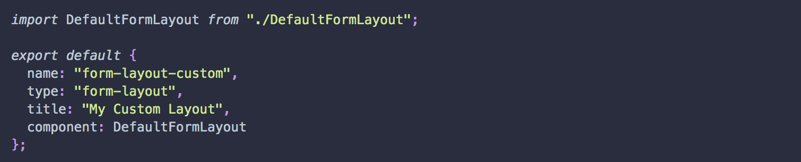
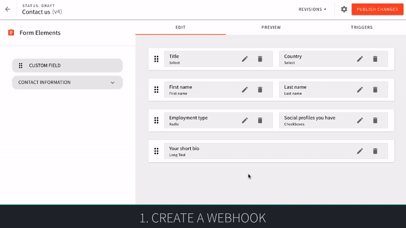

A crucial part of most websites are forms, be that simple contact forms or more complex lead generation ones. Businesses rely on these forms to generate revenue, grow their user base, and even handle payments. Forms are everywhere.

Building forms historically has always been a hassle. There are either low-level tools for developers where they have to code all the interaction and rules manually. On the other hand, there are form builder tools that target marketers. Using them, you can only drag&drop elements and can’t change the form functionality.

Being developers ourselves, we felt the pains of bad tooling or apps with too restrictive customization options.

## Introducing Hoola AI Serverless Form Builder

With Hoola AI, we want to empower developers to create serverless applications by providing a foundation, processes, and ready-made apps. Form Builder is one of those apps.

Like all other Hoola AI CMS apps, Form Builder is designed to be deployed into a serverless environment. At the moment, Hoola AI supports AWS, but the support for other cloud vendors is coming in 2020.

**Get started with Hoola AI Form Builder → [https://www.hoola.ai/serverless-app/form-builder](https://www.hoola.ai/serverless-app/form-builder)**

[We launched Hoola AI Form Builder on Product Hunt today — we would appreciate it if you would support us there](https://www.producthunt.com/posts/webiny-serverless-cms-form-builder).

### Drag&Drop UI

There is a drag&drop UI you can use to quickly build and preview your form. The preview screen renders your form using the selected theme and all the styles that come with it.

Each form field has validation rules and options, from a simple “required” option to more complex custom regex expressions.

### Themeable & Customizable

Hoola AI Form Builder utilizes your current Hoola AI theme to render the form. You as a developer have full control over the theme, which is actually a set of React components. You can even add custom function callbacks, call 3rd party APIs, and much more.

To help you learn more about Form Builder and themes, we have prepared a whole section in our documentation: [https://docs.hoola.ai/docs/webiny-apps/form-builder/form-layouts](https://docs.hoola.ai/docs/webiny-apps/form-builder/form-layouts)

### Integrations & Plugins

By default there is an integration with Google’s ReCAPTCHA, but you can also specify additional integrations by providing a webhook URL.

Besides the basic integrations, like all other Hoola AI apps, it’s all about plugins. You can expand and change the functionality simply by registering new plugins. It’s best to go through this docs article to get started: [https://docs.hoola.ai/docs/deep-dive/plugins-crash-course](https://docs.hoola.ai/docs/deep-dive/plugins-crash-course)

### Multi-language Forms

At the moment, we are also working on adding multi-language support throughout Hoola AI CMS, and the Form Builder is one of the first apps to get this feature.

Create a single form, but serve it in several languages.

## Get Started

Here are the basic resources to get yourself familiarized with Hoola AI Form Builder:

**Product page**: [https://www.hoola.ai/serverless-app/form-builder](https://www.hoola.ai/serverless-app/form-builder/)

**Documentation**: [https://docs.hoola.ai/docs/webiny-apps/form-builder/introduction](https://docs.hoola.ai/docs/webiny-apps/form-builder/introduction)

**GitHub**: [https://github.com/webiny/webiny-js](https://github.com/webiny/webiny-js)

Give us a ping on our [chat](https://gitter.im/Hoola AI/webiny-js) or [community forum](https://community.hoola.ai/), and let us know what you think about Hoola AI Form Builder.

New Hoola AI CMS installations get the Form Builder by default. For older installations please follow these [https://gist.github.com/SvenAlHamad/aaa3ad3fb34fc9513b24597ea9ee26ad](https://gist.github.com/SvenAlHamad/aaa3ad3fb34fc9513b24597ea9ee26ad)
