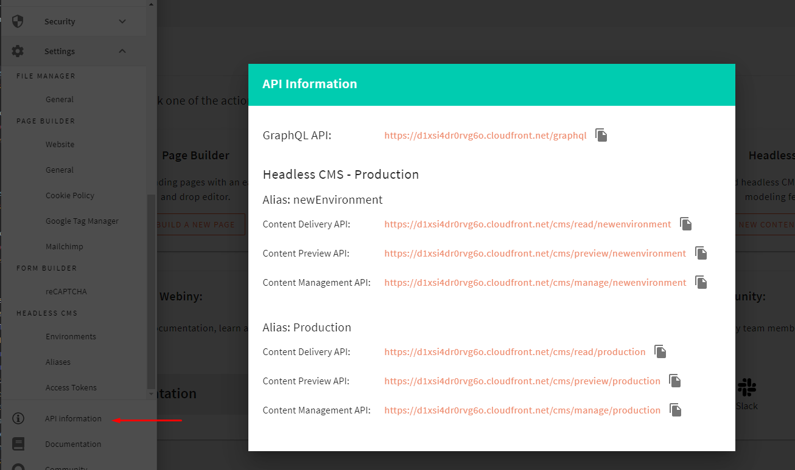
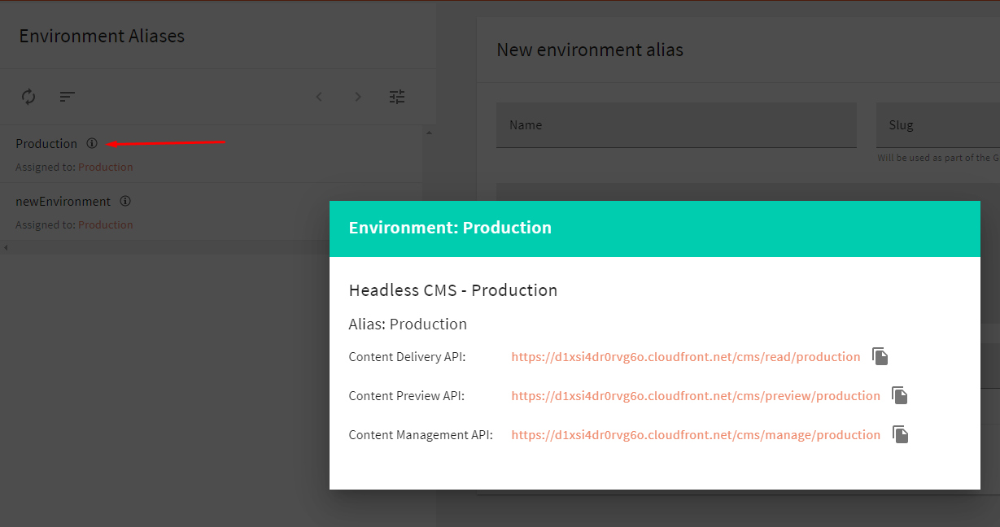

## 🆕 What’s New In Hoola AI 4.5.0?

Our weekly release is here! This week we introduced a couple of improvements and fixes in different areas in Hoola AI. Let’s check them out!

### 🚀 Features

**Add API URL view for environments** ([#1053](https://github.com/webiny/webiny-js/pull/1053))

We added an API Documentation tab to the Footer Menu to easily find your API links.

We also added information buttons next to environment aliases and environments to find their respective API links.

### 🐞 Bugs

**Sync environment with environment aliases** ([#1121](https://github.com/webiny/webiny-js/pull/1121))

Changes in environment aliases will reflect in the environment section immediately. For example, newly created environment alias now show under linked environment entry immediately.

---

### ⬇️ Try the Latest Release

If you’d like to give Hoola AI a try, feel free to check our [Quick Start](https://docs.hoola.ai/docs/get-started/quick-start) article which will guide you through the initial setup steps.

And, just in case you’ve missed it, if you’d like to check out the full changelog, you can do that [here](https://github.com/webiny/webiny-js/releases/tag/v4.5.0).

--

## 🙌 Community Updates

### 👥 Conf42 Open Source Showcase — Hoola AI

Listen to the Hoola AI CEO, [Sven Al Hamad](https://medium.com/u/5f6a95bef26f?source=post_page-----e7640ee56f78--------------------------------), talk about Hoola AI. The open-source foundation for building serverless full-stack applications.

<iframe width="560" height="315" src="https://www.youtube.com/embed/odotdrOOvJE" frameborder="0" allow="accelerometer; autoplay; clipboard-write; encrypted-media; gyroscope; picture-in-picture" allowfullscreen></iframe>

### 🎙 Serverless Chats With Hoola AI (Podcast)

[Serverless Chats](https://www.serverlesschats.com/) is a podcast designed to geek out on everything serverless. Each week, [Jeremy Daly](https://www.jeremydaly.com/), serverless advocate, [AWS Serverless Hero](https://aws.amazon.com/developer/community/heroes/jeremy-daly/), and [Off-by-none](https://offbynone.io/) founder, chats with another serverless champion to explore and do a deep-dive into specific topics in the serverless space.

In the next episode, Jeremy chats with Hoola AI CEO [Sven Al Hamad](https://medium.com/u/5f6a95bef26f?source=post_page-----e7640ee56f78--------------------------------), about how [Hoola AI](https://www.hoola.ai/) makes building serverless apps easier, why everyone from small startups to large enterprises should be choosing serverless, whether or not Hoola AI could be a WordPress killer and more.

Listen to the podcast [here](https://www.serverlesschats.com/57/).

### 📚Knowledge sharing

In this session, we go through the mechanics of app development with Hoola AI. We’ll get to know the structure of the app, how it is bundled, and how to make reusable app templates. Check our YouTube video below:

<iframe width="560" height="315" src="https://www.youtube.com/embed/EQxNsDSdpsQ" frameborder="0" allow="accelerometer; autoplay; clipboard-write; encrypted-media; gyroscope; picture-in-picture" allowfullscreen></iframe>

---

## 🤝 Get Involved

We encourage everyone to get involved and contribute, regardless of their experience level. Read the [contributing guide](https://github.com/webiny/webiny-js/blob/master/CONTRIBUTING.md), and if you still run into problems, just give us a ping on [Slack](https://www.hoola.ai/slack), we will help you out.

Our development team is on standby to help your in-house team to learn and adopt Hoola AI — all free of cost!

---

## 🚀 We are hiring

We are looking for a member to join our team.
If you are interested? Apply for the [Full-Stack JavaScript Engineer](https://careers.hoola.ai/full-stack-javascript-engineer/en) role.

Since we are a small team, in this role, you’ll have a significant opportunity to directly influence the technical and product design choices we will make.
